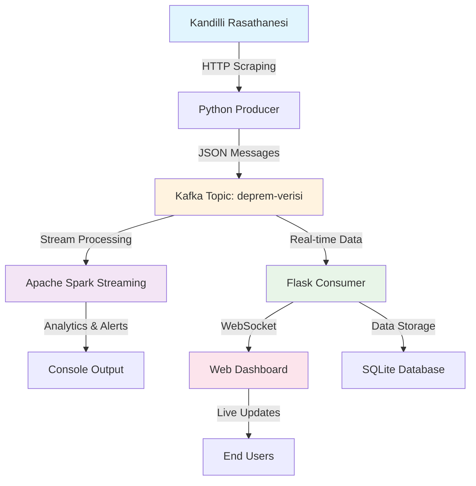

# 🌍 Kandilli Deprem Dashboard - Gerçek Zamanlı Deprem İzleme Sistemi

Kandilli Rasathanesi verilerini kullanarak gerçek zamanlı deprem takibi yapan, Kafka tabanlı streaming mimarisiyle geliştirilmiş kapsamlı analiz ve görselleştirme platformu.


---

## 📋 Proje Özeti

Bu sistem, **Kandilli Rasathanesi**'nden anlık deprem verilerini çekerek, modern stream processing teknolojileri ile işleyen ve kullanıcı dostu bir web arayüzü üzerinden sunan gerçek zamanlı deprem izleme platformudur.

### 🎯 Ana Hedef
Türkiye'deki deprem aktivitelerini gerçek zamanlı olarak takip etmek, analiz etmek ve görselleştirmek için kapsamlı bir veri pipeline sistemi oluşturmak.

---

## 🚀 Özellikler

- 🔄 **Gerçek Zamanlı Veri Toplama**
  Kandilli Rasathanesi'nden her dakika güncel deprem verilerini otomatik olarak çeker.

- 📡 **Kafka Streaming Mimarisi**  
  Yüksek performanslı, ölçeklenebilir veri akışı için Apache Kafka kullanır.

- ⚡ **Apache Spark ile Büyük Veri İşleme**
  Streaming veriler üzerinde gerçek zamanlı analiz, filtreleme ve aggregasyon işlemleri yapar.

- 🌐 **Flask Web Dashboard**
  WebSocket destekli, interaktif web arayüzü ile anlık deprem bildirimleri.

- 📊 **İstatistik ve Analiz**
  - En aktif bölgelerin tespiti
  - Ortalama büyüklük hesaplamaları  
  - Günlük/haftalık trend analizleri
  - M≥4.0 depremlerde otomatik uyarı sistemi

- 💾 **SQLite Veri Depolama**
  Tüm deprem verilerinin yerel veritabanında güvenli saklanması.

- 🐳 **Docker Container Desteği**
  Kolay kurulum ve deployment için containerized mimari.

---

## 🏗️ Sistem Mimarisi



---

## 🛠️ Teknoloji Stack'i

| Bileşen | Teknoloji | Versiyon | Açıklama |
|---------|-----------|----------|----------|
| **Producer** | Python + Requests | 3.8+ | Kandilli verilerini çeker ve Kafka'ya gönderir |
| **Message Queue** | Apache Kafka | 2.8+ | Yüksek performanslı veri akışı |
| **Stream Processing** | Apache Spark | 3.4+ | Gerçek zamanlı veri analizi |
| **Web Framework** | Flask + SocketIO | 2.3+ | Web dashboard ve API servisleri |
| **Database** | SQLite | 3.x | Hafif, dosya tabanlı veritabanı |
| **Orchestration** | Docker Compose | 3.8 | Container yönetimi |
| **Frontend** | HTML5 + WebSocket | - | Responsive web arayüzü |

---

## 📦 Kurulum

### Ön Gereksinimler
- Python 3.8 veya üzeri
- Docker ve Docker Compose
- 4GB RAM (Spark için önerilen)
- 2GB disk alanı

### 1. Projeyi İndirin
```bash
git clone https://github.com/your-username/kandilli-deprem-dashboard.git
cd kandilli-deprem-dashboard
```

### 2. Python Sanal Ortamı Oluşturun
```bash
python -m venv .venv

# Windows
.venv\Scripts\activate

# Linux/Mac
source .venv/bin/activate
```

### 3. Bağımlılıkları Kurun
```bash
pip install -r requirements.txt
```

### 4. Kafka ve Zookeeper'ı Başlatın
```bash
docker-compose -f docker-compose-deprem.yml up -d
```

### 5. Sistemi Başlatın
```bash
python main.py
```

---

## 🎮 Kullanım

### Web Dashboard'a Erişim
Sistem başlatıldıktan sonra:
- **Ana Dashboard**: http://localhost:5000
- **API Endpoints**:
  - Son depremler: `http://localhost:5000/api/recent/50`
  - İstatistikler: `http://localhost:5000/api/stats`

### Kafka UI (Opsiyonel)
Kafka cluster'ını izlemek için:
- **Kafka UI**: http://localhost:8180

---

## 📁 Proje Yapısı

```
kandilli-deprem-dashboard/
├── 📄 main.py                          # Ana orchestrator
├── 📁 producer/
│   └── 📄 kandilli_producer.py         # Veri toplama servisi
├── 📁 consumer/  
│   └── 📄 spark_streaming.py           # Spark streaming işlemleri
├── 📁 app/
│   ├── 📄 app.py                       # Flask web uygulaması
│   └── 📁 templates/
│       └── 📄 index.html               # Web dashboard
├── 📄 docker-compose-deprem.yml        # Kafka infrastructure
├── 📄 requirements.txt                 # Python dependencies
└── 📄 README.md                        # Bu dosya
```

---

## 🔧 Konfigürasyon

### Kafka Ayarları
```python
# producer/kandilli_producer.py
KAFKA_BOOTSTRAP_SERVERS = 'localhost:9192'
KAFKA_TOPIC = 'deprem-verisi'
FETCH_INTERVAL = 60  # saniye
```

### Spark Streaming Ayarları
```python
# consumer/spark_streaming.py
SPARK_APP_NAME = "KandilliDepremAnalizi"
KAFKA_BOOTSTRAP_SERVERS = "localhost:9192"
ALERT_THRESHOLD = 4.0  # Minimum büyüklük uyarısı
```

### Flask Ayarları
```python
# app/app.py
SECRET_KEY = 'kandilli-deprem-dashboard-2024'
HOST = '0.0.0.0'
PORT = 5000
DEBUG = True
```

---

## 📊 Veri Şeması

### Deprem Veri Modeli
```json
{
  "tarih": "2024.01.15",
  "saat": "14:23:45",
  "enlem": 40.1234,
  "boylam": 29.5678,
  "derinlik_km": 8.2,
  "buyukluk": 3.4,
  "yer": "MARMARA DENİZİ"
}
```

### Veritabanı Şeması
```sql
CREATE TABLE depremler (
    id INTEGER PRIMARY KEY AUTOINCREMENT,
    tarih TEXT,
    saat TEXT,
    enlem REAL,
    boylam REAL,
    derinlik_km REAL,
    buyukluk REAL,
    yer TEXT,
    timestamp DATETIME DEFAULT CURRENT_TIMESTAMP
);
```

---

## 🚨 Uyarı Sistemi

Sistem, belirlenen kriterlere göre otomatik uyarılar üretir:

| Büyüklük | Uyarı Seviyesi | Aksiyon |
|----------|---------------|---------|
| M ≥ 4.0 | 🟡 Orta | Console log + WebSocket bildirimi |
| M ≥ 5.0 | 🟠 Yüksek | Vurgulanmış bildirim |
| M ≥ 6.0 | 🔴 Kritik | Acil durum bildirimi |

---

## 📈 Performans Metrikleri

- **Veri Toplama Sıklığı**: 60 saniye
- **Kafka Throughput**: ~1000 mesaj/saniye
- **Spark Micro-batch**: 5 saniye
- **WebSocket Latency**: <100ms
- **Veritabanı Response**: <10ms

---

## 🐳 Docker Deployment

### Geliştirme Ortamı
```bash
# Kafka cluster'ı başlat
docker-compose -f docker-compose-deprem.yml up -d

# Uygulamayı yerel olarak çalıştır
python main.py
```

### Production Ortamı
```bash
# Tüm servisleri container'da çalıştır
docker-compose up -d --scale spark-worker=3
```

---

## 🧪 Test ve Doğrulama

### Unit Testler
```bash
python -m pytest tests/ -v
```

### Sistem Testleri
```bash
# Producer testi
python producer/kandilli_producer.py --test

# Consumer testi  
python consumer/spark_streaming.py --validation-mode

# API testleri
curl http://localhost:5000/api/stats
```

---

## 🔍 İzleme ve Logging

### Log Seviyeleri
- **INFO**: Normal sistem operasyonları
- **WARNING**: Beklenen ancak önemli durumlar
- **ERROR**: Hata durumları
- **CRITICAL**: Sistem kesintileri

### Monitoring Endpoints
- **Health Check**: `/health`
- **Metrics**: `/metrics`
- **Status**: Gerçek zamanlı sistem durumu

---

## 🤝 Katkıda Bulunma

1. Bu repository'yi fork edin
2. Feature branch oluşturun (`git checkout -b feature/yeni-ozellik`)
3. Değişikliklerinizi commit edin (`git commit -am 'Yeni özellik eklendi'`)
4. Branch'inizi push edin (`git push origin feature/yeni-ozellik`)
5. Pull Request oluşturun

### Geliştirme Kuralları
- PEP 8 coding standards'ına uyun
- Tüm fonksiyonlar için docstring yazın
- Unit test coverage %80'in üzerinde olsun
- Type hints kullanın

---

## 📋 TODO Listesi

- [ ] Redis cache entegrasyonu
- [ ] PostgreSQL desteği
- [ ] Harita görselleştirmesi (Leaflet.js)
- [ ] Mobile responsive tasarım
- [ ] Email/SMS bildirim sistemi
- [ ] Historical data analytics
- [ ] Machine learning prediction models
- [ ] API rate limiting
- [ ] Kubernetes deployment manifests

---

## ⚖️ Lisans

Bu proje MIT lisansı altında lisanslanmıştır. Detaylar için [LICENSE](LICENSE) dosyasına bakın.

---

## 🙏 Teşekkürler

- [Kandilli Rasathanesi](http://www.koeri.boun.edu.tr/) - Deprem verileri sağladığı için
- [Apache Kafka](https://kafka.apache.org/) - Streaming infrastructure
- [Apache Spark](https://spark.apache.org/) - Big data processing
- [Flask](https://flask.palletsprojects.com/) - Web framework

---

## 📞 İletişim

**Geliştirici**: [GitHub Kullanıcı Adınız](https://github.com/your-username)  
**E-posta**: your-email@domain.com  
**Proje URL**: https://github.com/your-username/kandilli-deprem-dashboard

---

## 📈 Proje İstatistikleri


---

<div align="center">

**⭐ Bu projeyi beğendiyseniz star vermeyi unutmayın! ⭐**

*Son güncelleme: 2024*

</div>
